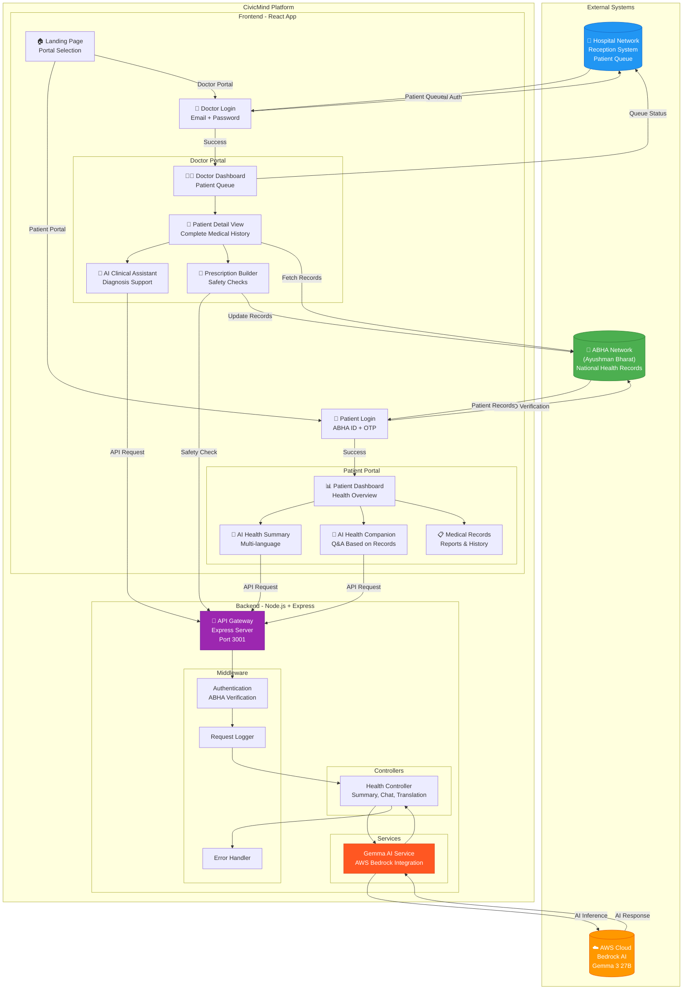
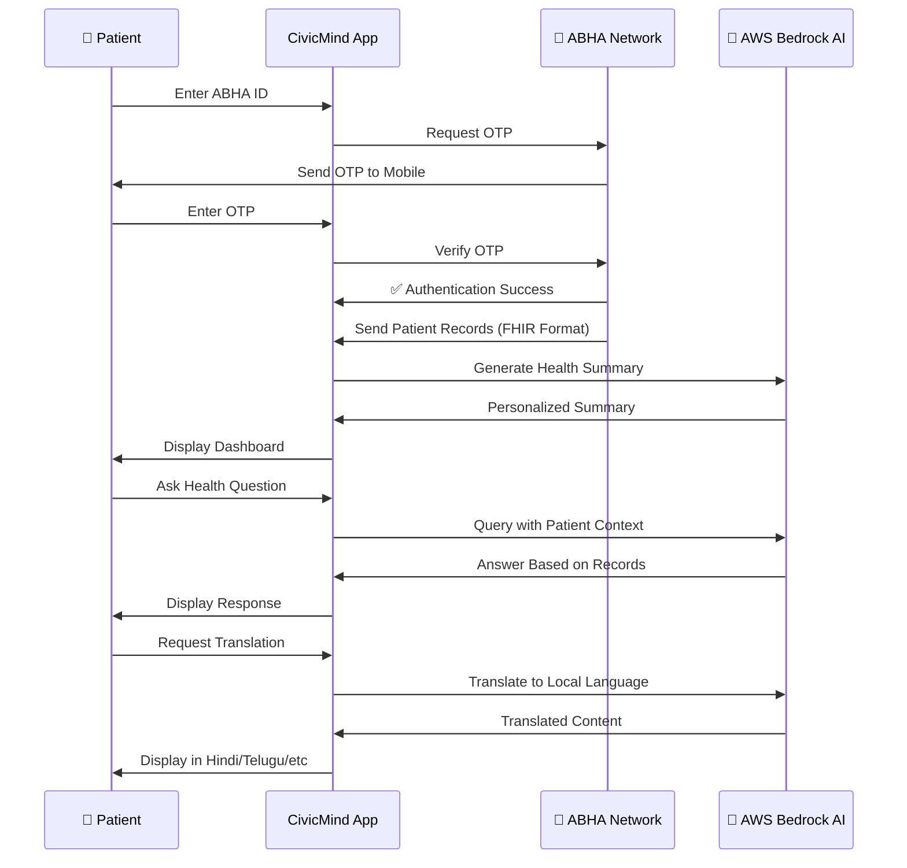
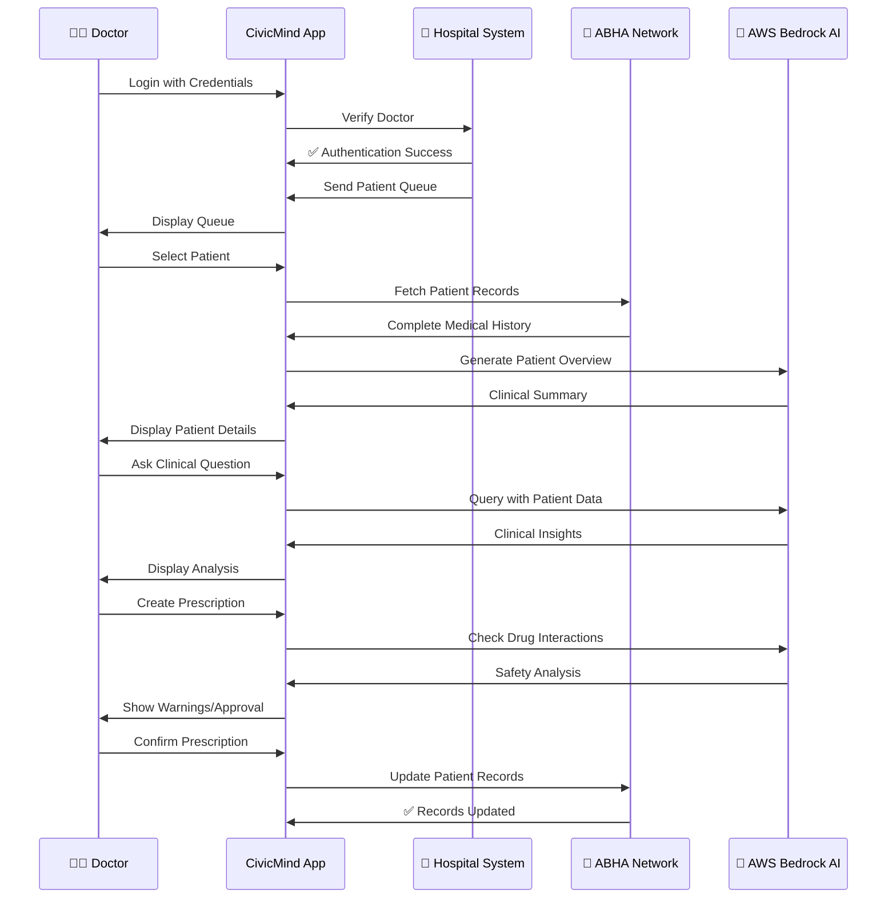
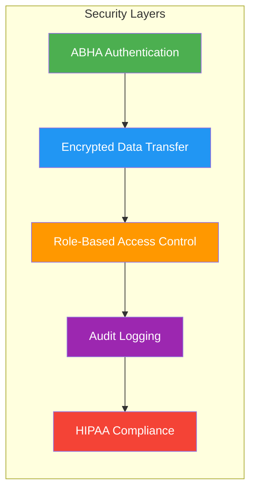
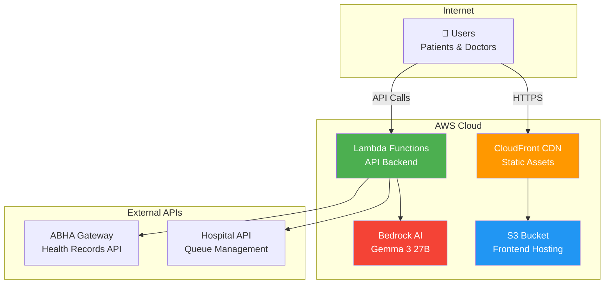
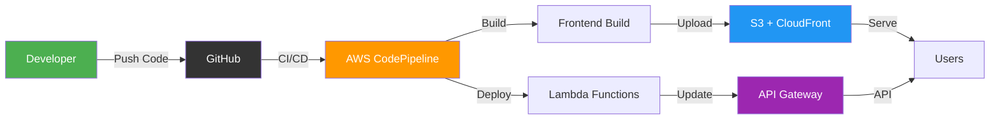

# CivicMind Health AI - System Architecture

## 🏗️ Complete System Architecture

## 🔄 Data Flow Diagrams

### Patient Journey Flow

### Doctor Workflow Flow

## 🏛️ System Components

### 1. **ABHA Network Integration**
- **Purpose**: National health records repository
- **Data Format**: FHIR (Fast Healthcare Interoperability Resources)
- **Authentication**: ABHA ID + OTP verification
- **Operations**:
  - Fetch patient medical history
  - Update prescriptions and diagnoses
  - Sync lab reports
  - Store consultation notes

### 2. **Hospital Network Integration**
- **Purpose**: Local hospital management system
- **Functions**:
  - Patient registration at reception
  - Queue management
  - Doctor authentication
  - Appointment scheduling
  - Emergency patient handling

### 3. **AWS Bedrock AI (Gemma 3 27B)**
- **Purpose**: AI-powered medical intelligence
- **Capabilities**:
  - Generate patient health summaries
  - Answer health questions (patient-specific)
  - Provide clinical decision support
  - Check prescription safety
  - Translate medical content to 6+ languages
  - Analyze patient trends

### 4. **CivicMind Application**
- **Frontend**: React + Vite + TailwindCSS
- **Backend**: Node.js + Express
- **Architecture**: Feature-based modular design
- **Security**: ABHA-compliant encryption

## 🔐 Security & Compliance

### Security Features:
1. **ABHA Authentication**: Government-verified identity
2. **OTP Verification**: Two-factor authentication
3. **Encrypted Communication**: TLS/SSL for all data transfer
4. **Role-Based Access**: Separate patient/doctor permissions
5. **Audit Trail**: All actions logged for compliance
6. **Data Privacy**: HIPAA and ABDM guidelines

## 📊 Technology Stack

| Layer | Technology | Purpose |
|-------|-----------|---------|
| **Frontend** | React 18 + Vite | Modern UI framework |
| **Styling** | TailwindCSS | Responsive design |
| **Backend** | Node.js + Express | API server |
| **AI Engine** | AWS Bedrock (Gemma 3 27B) | Medical AI |
| **Health Records** | ABHA Network (FHIR) | National health data |
| **Hospital System** | REST API Integration | Queue management |
| **Authentication** | ABHA ID + OTP | Secure login |
| **Deployment** | AWS Lambda + S3 | Serverless architecture |

## 🌐 Network Architecture

## 🚀 Deployment Flow

## 📱 User Interfaces

### Patient Portal Features:
- 🏠 Health overview dashboard
- 🤖 AI health summary (multi-language)
- 💬 AI health companion chatbot
- 📋 Medical records viewer
- 🔊 Voice accessibility (text-to-speech)
- 🌐 6 language support

### Doctor Portal Features:
- 👥 Patient queue management
- 📊 AI-generated patient briefs
- 🤖 Clinical decision support
- 💊 Smart prescription builder
- ⚠️ Drug interaction warnings
- 📝 Consultation notes

## 🔄 Real-time Updates

The system maintains real-time synchronization:
- **ABHA Network**: Bi-directional sync for health records
- **Hospital System**: Live patient queue updates
- **AI Processing**: Sub-second response times
- **Multi-device**: Sync across patient/doctor devices

---

**Built with ❤️ for Indian Healthcare**  
*Powered by ABHA Network & AWS Bedrock AI*
