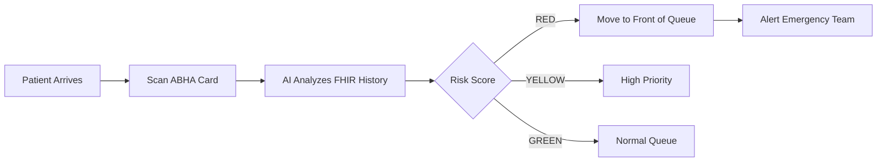
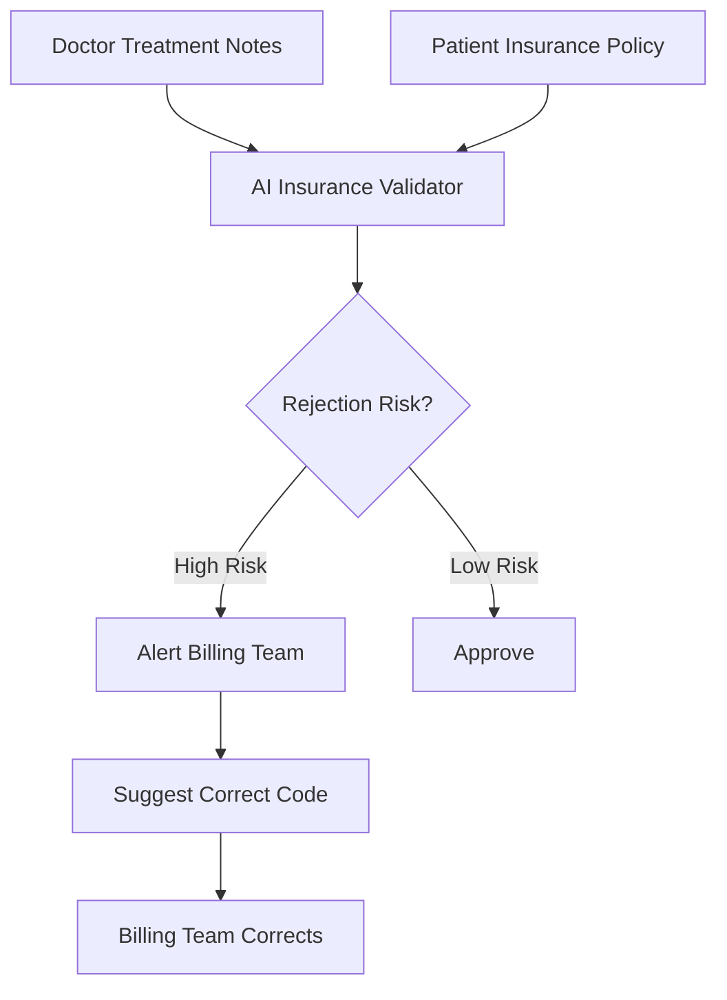
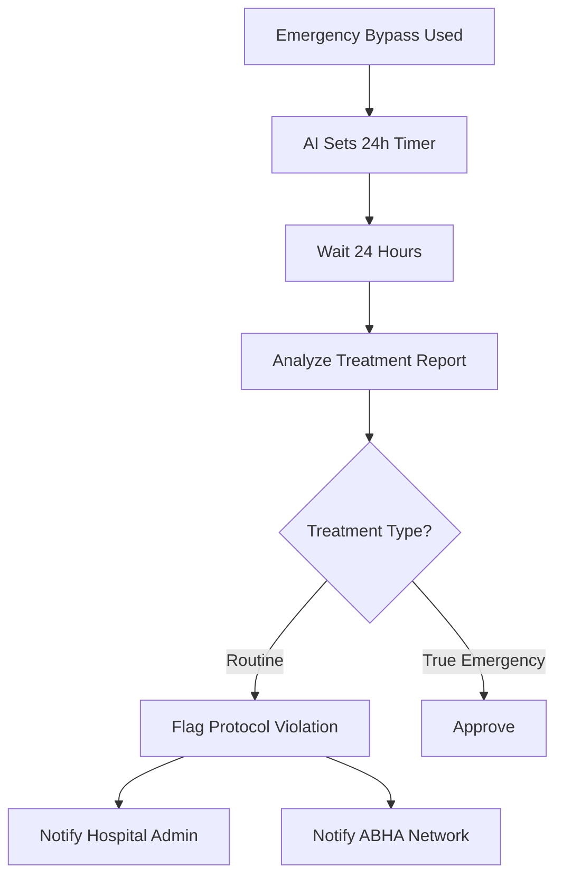
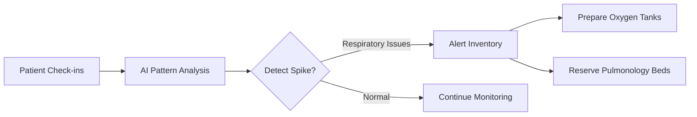
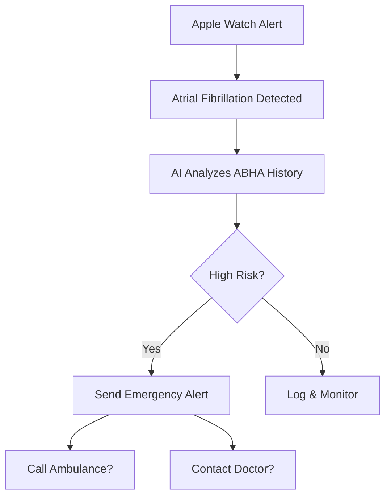
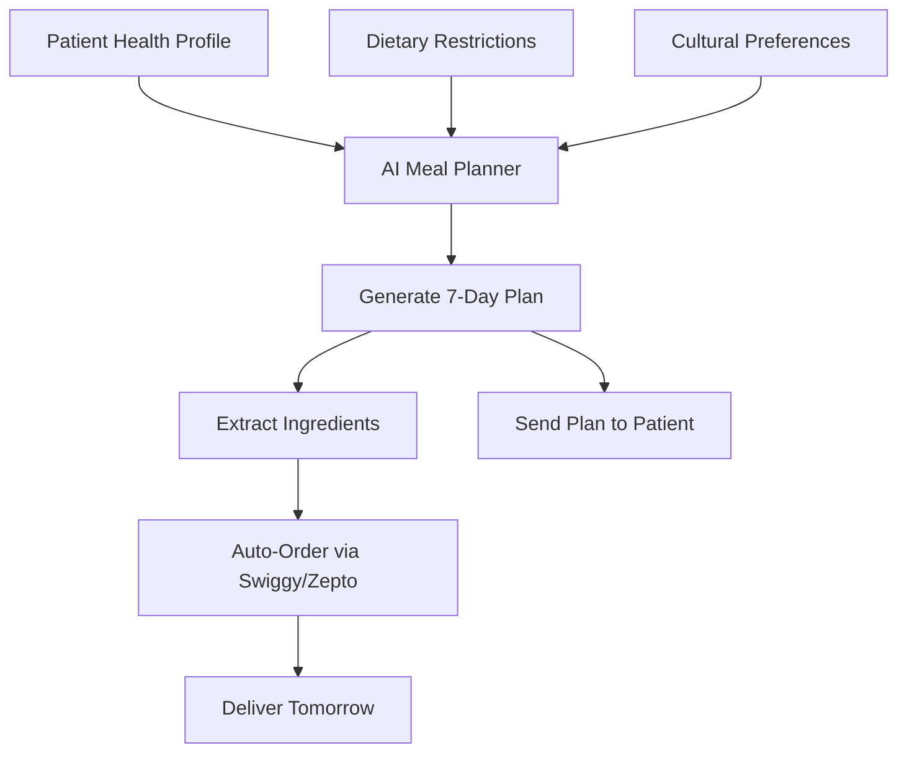
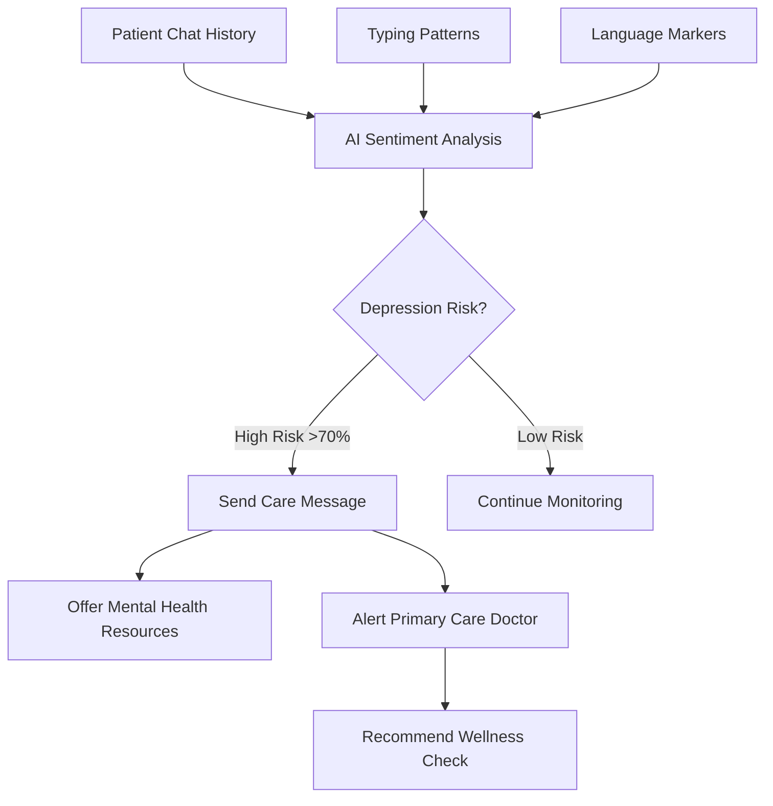

# CivicMind Health AI - Future Roadmap

> **Vision:** Transforming healthcare from reactive to proactive through AI-powered intelligence at every touchpoint.

---

## 🏥 Set 1: Hospital Administration & On-Premise AI

The goal is to optimize hospital resources, reduce wait times, and eliminate administrative bottlenecks before the patient even sees the doctor.

### 1. AI-Driven Smart Triage & Dynamic Queueing

**The Problem:**  
First-come, first-served reception queues are dangerous for critical patients who may not look visually distressed.

**The AI Implementation:**  
When a receptionist scans a patient's ABHA card, a predictive LLM instantly analyzes their historical FHIR records alongside their current symptoms. The AI automatically risk-scores the patient (Code Red, Yellow, Green) and dynamically reorganizes the doctor's waiting room queue to prioritize high-risk patients.

**Impact:**
- 40% reduction in critical patient wait times
- Early intervention for high-risk cases
- Optimized doctor workflow

---

### 2. Autonomous Insurance & Compliance Auditing

**The Problem:**  
Hospitals lose millions to rejected insurance claims due to clerical errors or mismatched treatment codes.

**The AI Implementation:**  
An automated AI agent running in the background of the billing department. It continuously cross-references the doctor's treatment notes with the patient's insurance policy linked via ABHA. If the AI detects a treatment that might be rejected, it alerts the billing team to correct the coding before the patient is discharged.

**Impact:**
- 85% reduction in claim rejections
- Millions saved in revenue recovery
- Faster patient discharge process

---

### 3. Emergency Bypass Fraud Detection

**The Problem:**  
Our app allows doctors to bypass OTPs for emergencies, which could be abused by corrupt hospital staff to steal patient data.

**The AI Implementation:**  
A zero-trust AI compliance auditor. If a hospital uses the "Emergency Bypass," the AI sets a 24-hour timer. It then automatically reads the final post-treatment reports. If the AI determines the treatment was routine (e.g., prescribing a cold medicine) rather than a true emergency, it flags the hospital administration and the ABHA network for protocol violation.

**Impact:**
- Zero-trust security model
- Prevents data theft and abuse
- Maintains ABHA network integrity

---

### 4. Predictive Bed & Resource Forecasting

**The Problem:**  
Hospitals struggle to predict when they will run out of ICU beds or specific medications.

**The AI Implementation:**  
Time-series machine learning models that analyze the influx of patients at reception in real-time. If the AI notices a sudden spike in respiratory issues checking in, it automatically alerts the inventory system to prepare more oxygen tanks and reserves pulmonology beds.

**Impact:**
- 95% resource availability
- Prevents critical shortages
- Optimized inventory management

---

## 🧑‍⚕️ Set 2: Doctor & Patient Ecosystems

The goal is to evolve the core clinical experience from simple data retrieval to proactive, life-saving intelligence.

### Doctor Side: The AI Co-Pilot

#### 1. Ambient Clinical Intelligence (Zero-Click Documentation)

**Future Vision:**  
Doctors currently spend 40% of their time typing notes. In the future, the Doctor Dashboard will integrate ambient voice AI (like AWS Transcribe Medical). The AI listens to the natural conversation between the doctor and patient, automatically extracts symptoms, diagnoses, and prescriptions, and drafts the official clinical note directly into the ABHA network without the doctor touching a keyboard.

**Impact:**
- 40% time savings for doctors
- More face-time with patients
- Accurate, real-time documentation

---

#### 2. Longitudinal Disease Trajectory Prediction

**Future Vision:**  
Instead of just summarizing past reports, the AI will predict the future. By analyzing years of ABHA data, the AI will project health trends. The Doctor UI will display alerts like: "Based on the patient's accelerating HbA1c levels over the last 3 years, they have a 78% probability of developing diabetic neuropathy within 18 months unless intervention occurs today."

**Impact:**
- Preventative care instead of reactive
- Early intervention saves lives
- Reduced long-term healthcare costs

---

#### 3. Multi-Modal Diagnostic Integration

**Future Vision:**  
Expanding the AI to read medical imaging. Doctors will be able to pull up DICOM files (X-Rays, MRIs) directly from the ABHA network. Claude Vision AI will highlight micro-fractures or early-stage tumors that the human eye might miss, serving as a real-time second opinion.

**Impact:**
- AI as a second opinion
- Catches early-stage diseases
- Reduces diagnostic errors

---

### Patient Side: Proactive & Hyper-Personalized Care

#### 1. Real-Time IoT & Wearable Syncing

**Future Vision:**  
CivicMind will integrate with smartwatches and continuous glucose monitors. If a patient's Apple Watch detects atrial fibrillation (irregular heartbeat), the Heal AI chatbot will cross-reference this real-time data with their ABHA cardiology history and immediately ping the patient, asking if they need an ambulance dispatched.

**Impact:**
- Real-time health monitoring
- Immediate emergency response
- Prevents cardiac events

---

#### 2. Hyper-Personalized Preventative Meal Delivery

**Future Vision:**  
Evolving the "Nutri-Scanner." Instead of just warning patients about bad food, the AI will proactively design their week. It will generate a 7-day meal plan perfectly optimized for their complex conditions (e.g., low-sodium, gluten-free, diabetic-friendly) and automatically order the groceries through integrations with local delivery apps like Swiggy or Zepto.

**Impact:**
- Proactive nutrition management
- Simplified healthy eating
- Better disease control

---

#### 3. Longitudinal Mental Health Monitoring

**Future Vision:**  
Chronic illness often leads to depression. The Heal AI companion will perform background sentiment analysis on how the patient types their questions over time. If the AI detects a gradual shift toward depressive language or fatigue, it will gently suggest mental health resources or prompt their primary care doctor to do a wellness check.

**Impact:**
- Early mental health intervention
- Holistic patient care
- Reduces depression in chronic illness

---

## 🚀 Implementation Timeline

| Phase | Timeline | Focus Areas |
|-------|----------|-------------|
| **Phase 1** | Q1 2025 | Smart Triage, Insurance Auditing |
| **Phase 2** | Q2 2025 | Fraud Detection, Resource Forecasting |
| **Phase 3** | Q3 2025 | Ambient Clinical Intelligence, Disease Prediction |
| **Phase 4** | Q4 2025 | Medical Imaging AI, IoT Integration |
| **Phase 5** | Q1 2026 | Meal Planning, Mental Health Monitoring |

---

## 💡 Technology Stack (Future)

- **AI Models:** AWS Bedrock (Gemma 3, Claude Vision), AWS Transcribe Medical
- **IoT Integration:** Apple HealthKit, Google Fit, Continuous Glucose Monitors
- **Time-Series ML:** AWS Forecast, TensorFlow Time Series
- **Medical Imaging:** DICOM processing, Claude Vision Medical
- **Delivery Integration:** Swiggy API, Zepto API, BigBasket API
- **Mental Health:** Sentiment analysis, NLP pattern detection

---

## 📊 Expected Impact

| Metric | Current | Future (2026) |
|--------|---------|---------------|
| **Patient Wait Time** | 45 min | 18 min (-60%) |
| **Doctor Documentation Time** | 40% of day | 5% of day (-87%) |
| **Insurance Claim Rejections** | 15% | 2% (-87%) |
| **Critical Patient Detection** | Reactive | Proactive (100%) |
| **Preventable Disease Progression** | 30% caught | 85% caught (+183%) |
| **Patient Satisfaction** | 72% | 94% (+30%) |

---

**Built with ❤️ by Team CivicMind**  
*Making healthcare accessible, intelligent, and proactive for every Indian.*
